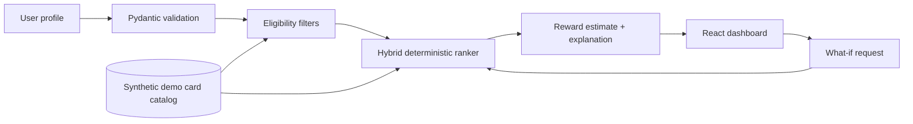
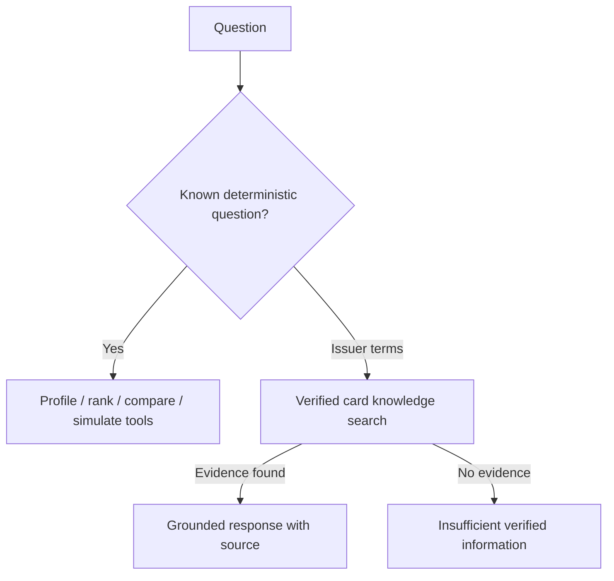

# CardLens AI architecture

## System boundary

The current demo starts with user-entered structured data. A deterministic Python service owns eligibility, ranking, suitability scores, and reward estimates. The UI presents those outputs and labels the synthetic catalog. No language model participates in the decision path.

## Recommendation pipeline

The engine filters cards only when a supplied value is below a stated demo minimum. Unknown income or score does not cause an invented value or automatic exclusion. Remaining cards are scored from spending match, estimated reward value, reward-type preference, known eligibility, fee fit, and lounge-benefit presence. Configured weights sum to 1. Scores are suitability scores, never approval odds.

## Grounding and extension points

The current assistant response is deterministic and cautious. There is no issuer document ingestion or RAG index yet, so card facts beyond the synthetic catalog are not answered as verified facts. A future RAG adapter should only answer from source-linked, versioned issuer documents and return an explicit insufficient-evidence response when retrieval is empty.

## Reliability and privacy

The API has health and readiness endpoints and works without AI credentials. The React client preserves its demo profile in memory and displays a retry message on API failure. Do not send payment credentials, CVV, bank logins, or secrets. Before production, add persistence with consent, authentication, database migrations, request IDs, rate limiting, structured redacted logs, source verification, and provider timeouts.
